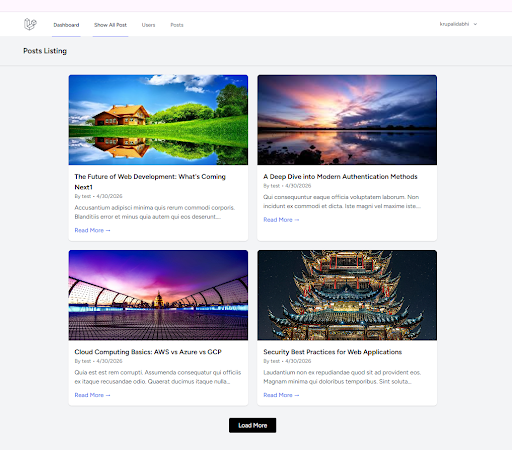
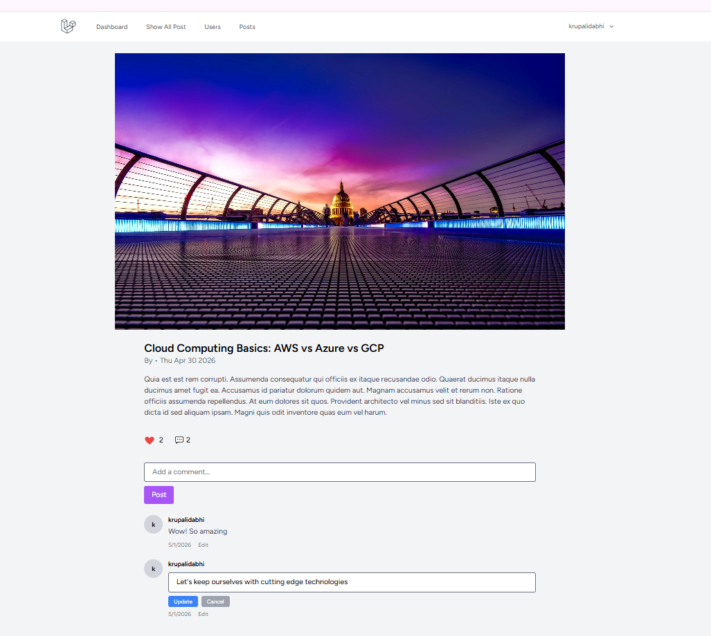

# Vue App Learning Project

## Purpose
This repository is a learning project built using Laravel starter kits and modern frontend tooling. The app is designed to practice creating posts, commenting on posts, and using full-stack workflows with Laravel and Vue.

## Built With
- PHP ^8.2
- Laravel Framework ^12.0
- Laravel Breeze starter kit
- Inertia.js / Inertia Laravel ^2.0
- Vue 3 ^3.4.0
- Vite ^7.0.7
- Tailwind CSS ^3.2.1
- Laravel Sanctum ^4.0
- Axios ^1.11.0
- Ziggy ^2.0

## Project Overview
This app is intended for learning and experimentation. It uses a Laravel backend with an Inertia-powered Vue frontend, so backend routes and frontend views work together without a separate API layer.

## Main Modules
### Post Module
A user can create and manage posts.
- Create new posts
- Display post title and body
- Show author and timestamp

**UI example:**
- Post card list
- Post details
- Like post and comment on post

**Post listing:** the first image shows the post listing screen with post titles and basic actions inside the Post Module section.

#### Post Details

**Post details:** the second image shows the detailed view for a single post, where users can read the full post and add comments.

### Comment Module
Users can comment on posts.
- Submit comments on a specific post
- Display comments under each post
- Basic comment interaction flow

**UI example:**
- Comment input area under posts
- Comment list display

**UI example:**
- Comment input area under posts
- Comment list display

### Post Interaction Module
The app also supports simple post interactions.
- Like posts
- Show like count

**UI example:**
- Like button on post cards
- Updated counts after interaction

## How to Use
1. Install backend dependencies:
   - `composer install`
2. Install frontend dependencies:
   - `npm install`
3. Copy env file and configure database:
   - `cp .env.example .env`
4. Generate application key:
   - `php artisan key:generate`
5. Run database migrations:
   - `php artisan migrate`
6. Start the app:
   - `npm run dev`
   - `php artisan serve`

## Notes
This project was created for learning and is based on starter templates. It focuses on practical modules for creating posts, commenting, and engaging with content.
